# Battle of Culloden

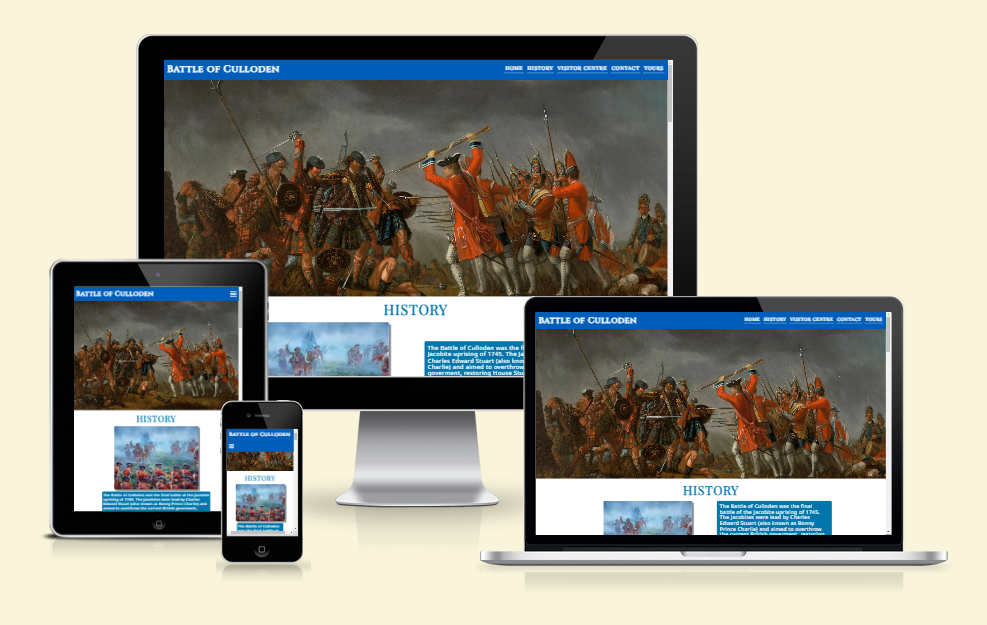

## Introduction

Battle of Culloden is a website giving a brief history of the Battle of Culloden and information regarding the visitor centre for the battlefield itself. 

This site is aimed at tourists of Scotland looking to plan a day out with the ability to book a guided tour around the museum and battlefield.

## UX

### User Goals

* Easy to navigate.
* Quality and necessary content.
* Asthetically pleasing with relevant images.
* Easy to find contact information.
* Booking form for guided tours.

### User Stories

* As a user, I want a website where I can find basic information on the Battle of Culloden.
* As a user, I want a website which is easy to navigate.
* As a user, I want easy to read information regarding the visitor centre.
* As a user, I want to easily find contact information for the centre.
* As a user, I want to be able to book a guided tour.
* As a user, I want pricing information on entry to the visitor centre and guided tours. 

### Site Owner Goals

* To attract tourists to the visitor centre.
* To increase the amount of guided tours being booked.
* To give potential visitors clear and concise information on the visitor centre.

### Requirements
* Easily navigated on a variety of screen sizes.
* Clear and easy to read information.
* Asthetically pleasing design to keep users engaged.
* Easy to find contact information.
* Easy to use booking form.

### Expectations
* I expect all navigation links to function correctly.
* I expect the website to look good on a variety of screen sizes.
* I expect any social media links to navigate to a new tab.
* I expect to know a form has been successfully submitted and that all relevant fields have been filled in correctly.
* I expect all information provided to be accurate.

## Design Choices

### Fonts

To add more character to the site, [Google Fonts](https://fonts.google.com/ "Google Fonts") was used to select 3 fonts to be used across the site. For the page logo, [Cinzel](https://fonts.google.com/specimen/Cinzel/ "Cinzel") was used as this fits the "history" aesthetic of the site and catches the eye of the user to create an immediate interest. For headers and navigation links, [Playfair Display](https://fonts.google.com/specimen/Playfair+Display "Playfair Display") was selected to make them stand out from the main text, it also blends well with theme of the site. Lastly, for the main text, [Noto Sans](https://fonts.google.com/noto/specimen/Noto+Sans "Noto Sans") was used as this compliments the other fonts, as well as being easy to read.

### Icons

Icons were selected from the website [Font Awesome](https://fontawesome.com/ "Font Awesome"). These icons are used to represent the navigation element on smaller screens and for social media links in the footer.

### Colours

The initial colour (demin) was selected due to it being the blue colour in the Scottish flag and would therefore fit the theme of Scottish history. The hexcode for demin was found using the website [Flag Color Codes](https://www.flagcolorcodes.com/scotland "Flag Color Codes"). [Coolors](http://coolors.co "Coolors") was then used to create the colour palette for the website with the first selection of denim being locked in and the rest of the palette following suite. 

The colours and their uses are listed below.

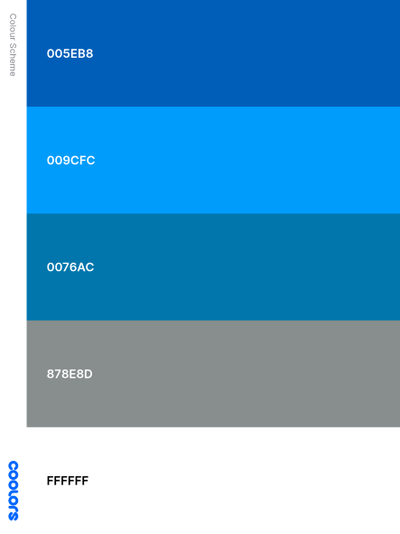

* #005EB8 - This colour will be used for the header, footer and form elements. 
* #0076AC - This colour will be used as a background colour for sections and elements, as well as for text.
* #009CFC - This colour will be used for the table and list borders.
* #878E8D - This colour will be used for box shadows and a small amount of text.
* #FFFFFF - This colour will be used as a background colour for sections and elements, as well as for text.

### Structure

The site will be built with mobile first mindset with the Samsung Galaxy S8+ (360px) being the smallest screen size for styling of site. Using [Bootstrap breakpoints](https://getbootstrap.com/docs/5.0/layout/breakpoints/ "Bootstrap breakpoints"), screen size breakpoints will be selected for media queries to add optimised styling for different viewing purposes. The break points are shown below.

| Screen Size | Breakpoint|
| ------------|-----------|
| x-small     | <576px    |
| small       | >= 576px  |
| medium      | >= 768px  |
| large       | >= 992px  |
| x-large     | >= 1200px |

## Wireframes

Wireframes have been developed to give a general structure and layout to the site on various device sizes. The wireframes were created using [Balsamic](https://balsamiq.com "Balsamic"). The first wireframe was created with mobile screen size in mind and scaled up to tablet and desktop sizes. A one-page website is used to allow the user to quickly access all content available. This is especially true for mobile users who will be scrolling down continuously, rather than navigating through different pages. 

The wireframes are linked below:

### [Desktop Wireframe](wireframes/boc-desktop.png)
### [Tablet Wireframe](wireframes/boc-tablet.png)
### [Mobile Wireframe](wireframes/boc-mobile.png)

## Features

### Navigation Bar

The navigation bar is fixed to the top of the screen to allow for easy access to different sections within the site. It is fully responsive in regards to different screen sizes and will change from a hamburger style drop down menu to a horizontal list on screen sizes greater than 992px. It also features the logo for the website to immediately capture the attention of the user.

* Desktop (>= 992px)
    * The navbar spans the entire width of the device and is complete with all links to direct to the different sections of the site. This allows for easy and clear access to all content for the user.

*Navbar large*

    
* The links will change colour when hovered over for better visibility for the user.

*Navbar hover*  

* Small devices (<992px)
    * As the screen size decreases, the navigation menu becomes too long to fit into the navbar and remain aesthetically pleasing. Therefore on devices with a screen size of 992px or less, the navigation menu will be toggled on and off via a hamburger icon. When checked, the navigation menu will appear as a dropdown list.

*Navbar Small* 

*Navbar dropdown* 
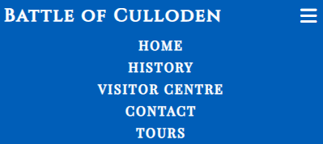

### Home Section

* The home section features the hero image which is an artist deptiction of the battle of Culloden. The image is very striking and works to create an interest for the user to learn more.

*Hero image*

### History Section

* The history section sets the scene with images and text content to build on the users initial interest in the battle. The images included are another depiction of the battle (similar to the hero image) and of both opposing side leaders. Each image is accompanied by some text, giving the user some basic information on the battle and the two forces.

*Large Screen Size*
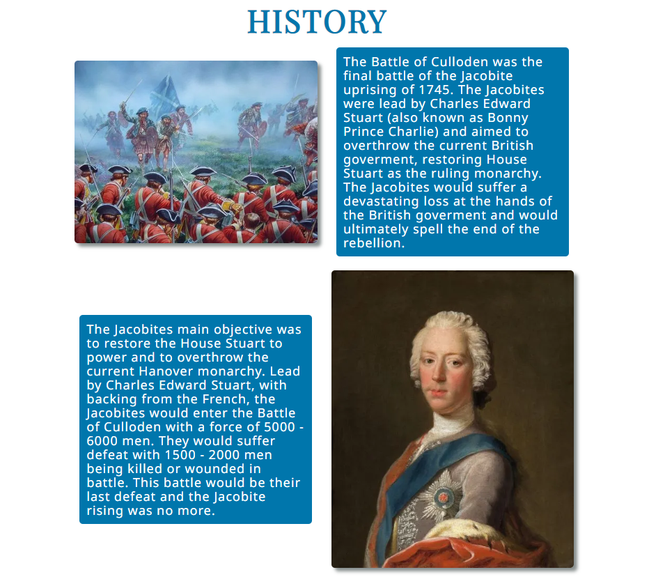

*Small and Medium Screen Size* 
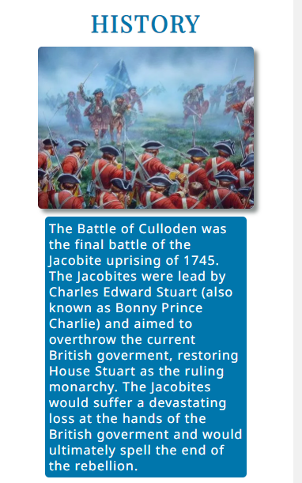

### Visitor Centre Section

* The visitor centre section has 3 subsections. The subsections are for the museum, the cafe and the battlefield.

* Museum Subsection
    * The museum subsection has some information on what users will hope to find in the museum with a couple of images of sample artifacts.
    * The user will also be given information regarding the opening/closing times of the museum.
     
*Desktop*
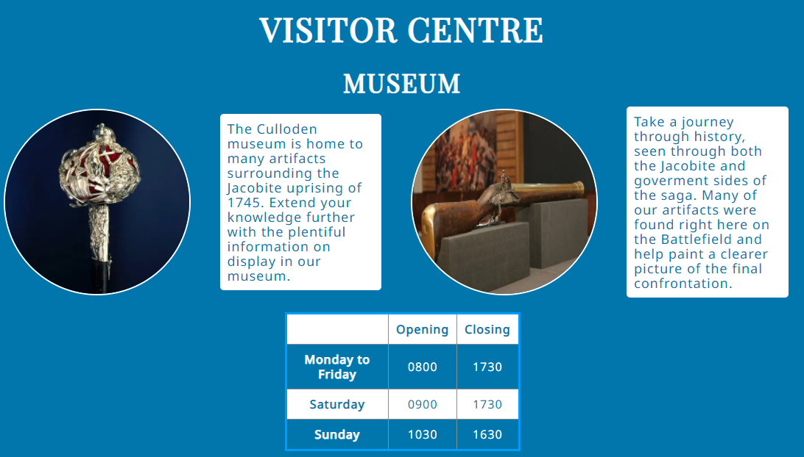

*Tablet* 
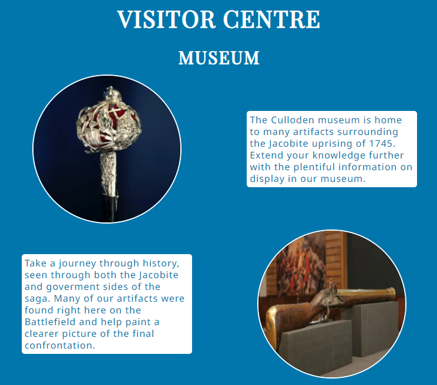

*Mobile* 
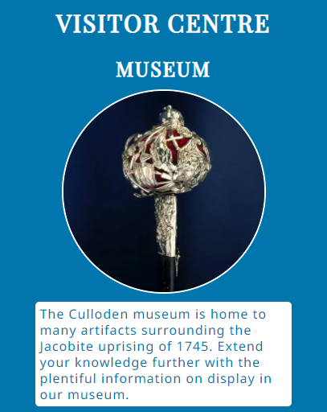

* Cafe Subsection
    * The cafe subsection includes a sample menu and the opening/closing times of the cafe.

*Desktop*
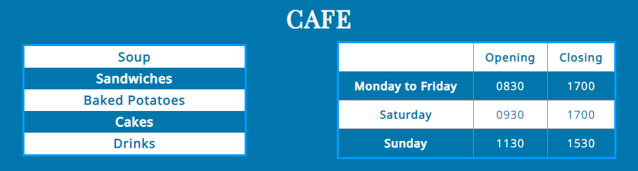

*Tablet* 
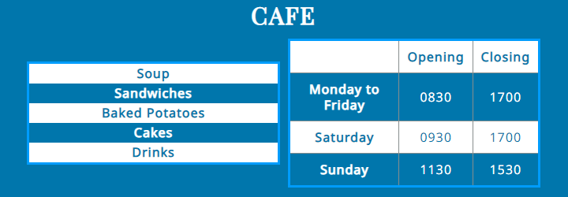

*Mobile* 
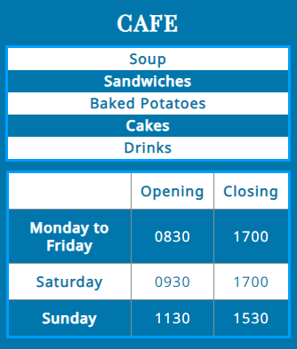

* Battlefield Subsection
    * The battlefield subsection features an image of Leanach cottage which is situated on the battlefield. This image gives the user an idea of the beauty to be found whilst exploring the battlefield.
    * The image is accompanied by some text describing the battlefield and other landmarks to be found.

*Large Screen Size*
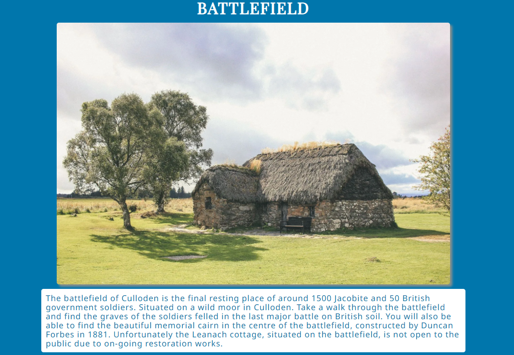

*Smaller Screen Size*  
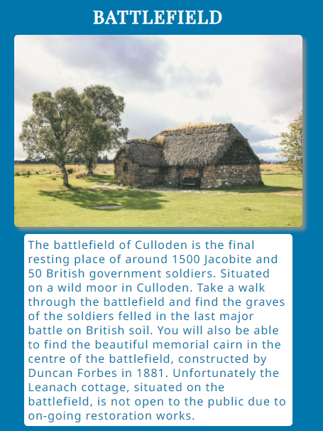

### Contact Information Section

* The contact information section contains the telephone number, email address and address of the visitor centre.
* A google maps preview is embedded in this section with the ability to open up google maps in another tab. This allows users to easily plan travel to the visitor centre. 

*Desktop*
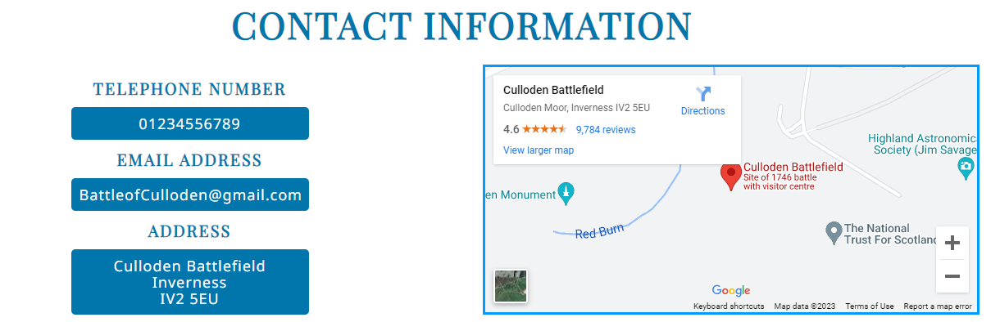

*Tablet* 
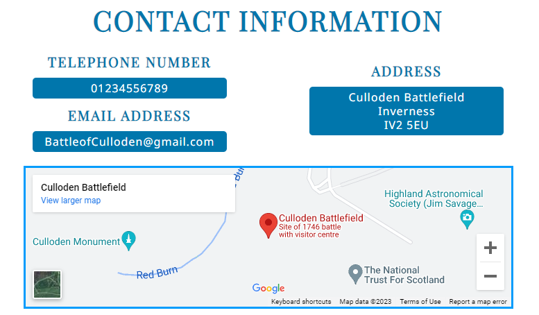

*Mobile* 
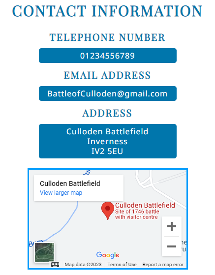

### Book a Tour Section
* The book a tour section includes information on the tours, such as how often they take place and pricing information for different group sizes.

*Tablet* 
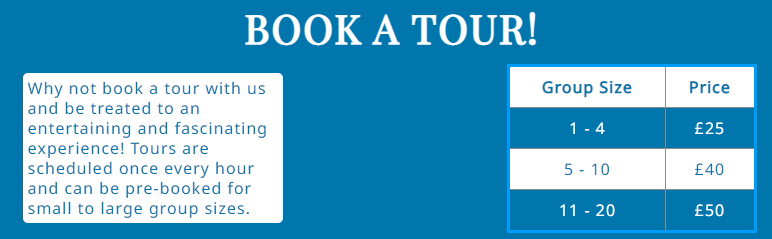

*Mobile* 
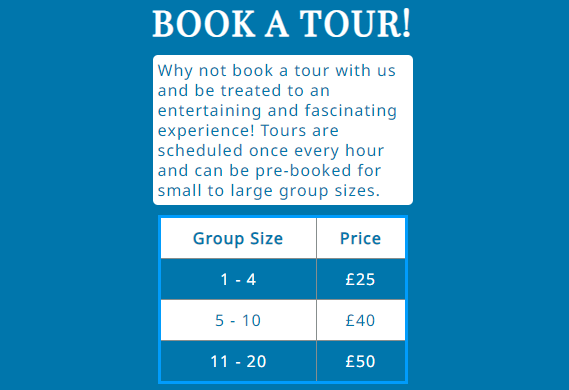

* There is also a booking form where the user can give information such as their name, email address, telephone number, group size, date of tour and special requirements.

*Desktop*
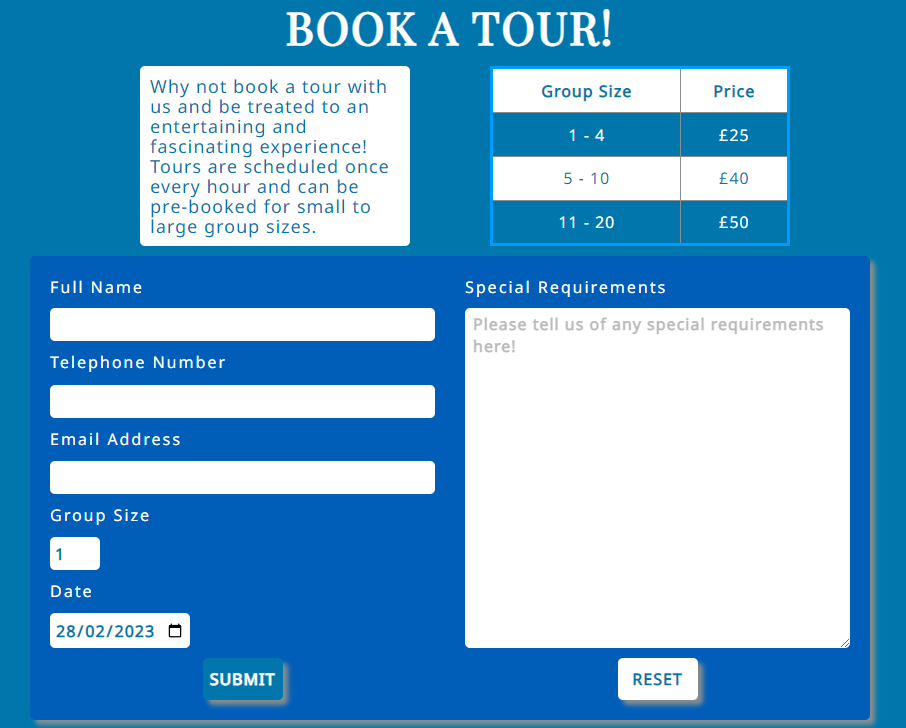

*Form on smaller screen* 
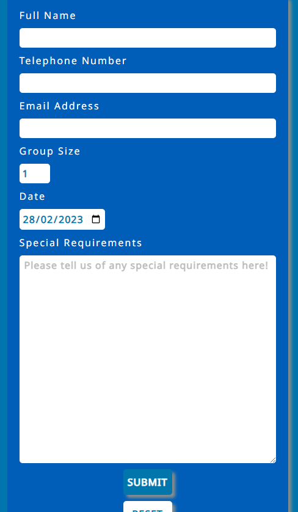

* Upon successful submission of the form, the user will be brought to a thank you page, confirming successful booking of a tour. The thank you page will include a link to navigate back to the main page.

*Thank you page*
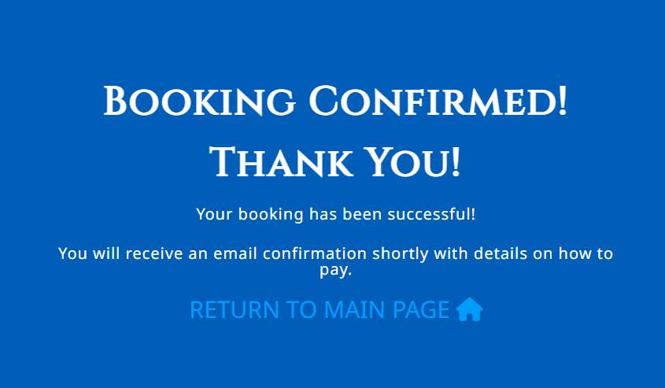

### Footer

* The footer section is styled to match the page header to maintain consistency. 
* The footer contains links to social media pages tied to the visitor centre. When clicked, these links will open in a new tab so the user does not have to navigate back to Battle of Culloden site.
* There is a hover effect to highlight the links, intended to improve the user experience.

*Footer*

### Features to be Implemented

* Thank you page to include link to pay for tour in advance.
* Social media links would link to official visitor centre pages and not home pages of social media sites.

## Technologies Used

### Languages

* [HTML](https://en.wikipedia.org/wiki/HTML "HTML")
* [CSS](https://en.wikipedia.org/wiki/CSS "CSS")

### Libraries & Framework

* [Google Fonts](https://fonts.google.com "Google Fonts")
* [Font Awesome](https://fontawesome.com "Font Awesome")

### Tools

* [Github](https://github.com "Github")
* [Gitpod](https://gitpod.io "Gitpod")
* [Balsamic](https://balsamiq.com "Balsamic")
* [Bootstrap](https://getbootstrap.com "Bootstrap")
* [Coolors](http://coolors.co "Coolors")
* [DevTools](https://developer.chrome.com/docs/devtools "DevTools")

